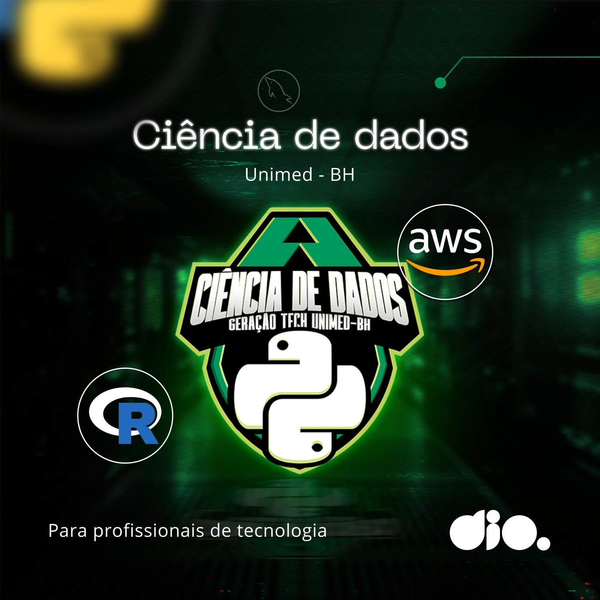

# 👩🏻‍🎓 Bootcamp DIO Geração Tech Unimed-BH - Ciência de Dados

**Repositório contendo os desafios e códigos desenvolvidos ao longo do [Bootcamp Geração Tech Unimed-BH - Ciência de Dado](https://www.dio.me/bootcamp/geracao-tech-unimed-bh-ciencia-de-dados) na plataforma DIO. Conteúdo do Bootcamp:**

## 💻 Prepare-se para a Jornada (Onboarding)
- Boas-vindas ao Bootcamp: geração Tech Unimed-BH - Ciência de Dados
- Geração Tech Unimed-BH - Ciência de Dados | Aula Inaugural
- Conheça as Oportunidades da DIO
- Seja Protagonista Neste Bootcamp
- Introdução à Programação e ao Pensamento Computacional
- Introdução ao Git e Github
- Como Entregar seu Desafio de Projeto
- Criando seu Primeiro Repositório no GitHub para Compartilhar seu Progresso

## 👩🏻‍💻 Python para Cientistas de Dados
- Ambiente de Desenvolvimento e Primeiros Passos com Python
- Conhecendo a Linguagem de Programação Python
- Tipos de Operadores com Python
- Estruturas Condicionais e de Repetição em Python
- Manipulação de Strings com Python
- Desafios Iniciais com Py - Unimed-BH
- Análise de Dados com Python e Pandas
- Trabalhando com Listas em Python e Python
- Conhecendo Tuplas em Python
- Explorando Conjuntos em Python e Python
- Aprendendo a Utilizar Dicionários em Python
- Dominando Funções em Python
- Fundamentos de ETL(Extract, Transform, Load) com Python
- Introdução a Programação Orientada a Objetos (POO) com Python
- Aprendendo o Conceito de Herança com Python
- Aplicando Encapsulamento em Python
- Conhecendo Polimorfismo em Python
- Ampliando o Conhecimentp em POO com Python
- Desafios Intermediários Py - Unimed-BH
- Descomplicando a criação de pacotes de processamento de imagens em Python
- Criando modelos com Python e Machine Learning para prever a evolução do COVID-19 no Brasil

## 👾 Módulo 2
- Introdução ao Kotlin
- Fundamentos de Orientação a Objetos com Kotlin
- Aplicando Conceitos de Coleções, Arrays e Listas
- Desenvolvimento Mobile Nativo para Android
- Componenetes, Layouts e UI/UX em Apps Android
- Java e Kotlin Juntos!? Construindo Apps Android
- Explorando Firebase Para Apps Android Resilientes
- Desmistificando o Android Studio na Prática
- Desafios Iniciais - Santander Mobile Developer

## 🤖 Módulo 3 - Android: Avançando com Kotlin
- Projetando o Primeiro Aplicativo Android Usando Kotlin
- Melhores Práticas para Debugging, Tratamento de Erros e Exceções
- Utilizando Recursos Nativos do Android
- Desafios Intermediários - Santander Mobile Developer
- Criando um App de Cartão de Visitas em Kotlin
- Introdução a Arquitetura da Plataforma Android com Kotlin
- Princípios de Desenvolvimento Kotlin com Clean Architeture e MVVM
- Aplicando TDD e Padrões de Testes no Desenvolvimento de Aplicativos Android
- Desafios Finais - Santander Mobile Developer
- Criando um App para Apresentar seu Portfólio do GitHub